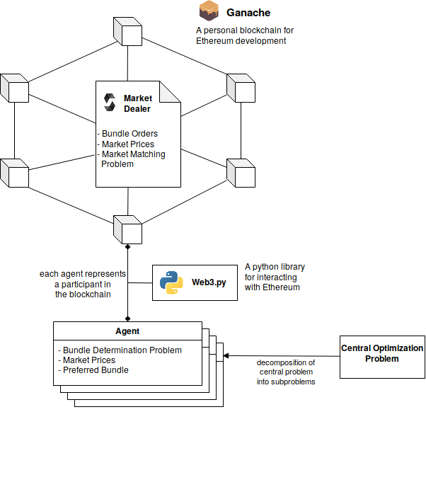

# LEM Simulation
**A blockchain-based local energy market (LEM) simulation.**

## Motivation of LEM
The generation from distributed renewable energy sources (RES) is constantly increasing. In contrast to power plants which run by non-renewable fossil fuels, distributed RES produce energy in a decentralized and volatile way, which is hard to predict. These characteristics of the distributed RES challenge the current energy system. The existing electric grid is build for centralized generation by large power plants and the design of the current wholesale markets is not able to react in real-time to a significant amount of distributed RES. Therefore, new market approaches are needed, to successfully integrate the increasing amount of distributed RES. A possible solution to the technical and market problems is Peer-to-Peer (P2P) energy trading in local energy markets (LEM).  
LEM, also called microgrid energy markets, consist of small scale prosumers, consumers and a market platform which enables the trading of locally generated energy between the parties of a community.

## Architecture



## Requirements
* Docker

## Installation
```
git clone https://github.com/nreinhol/lem_sim
```

## Run
```
cd /path/to/lem_sim
docker-compose up
```